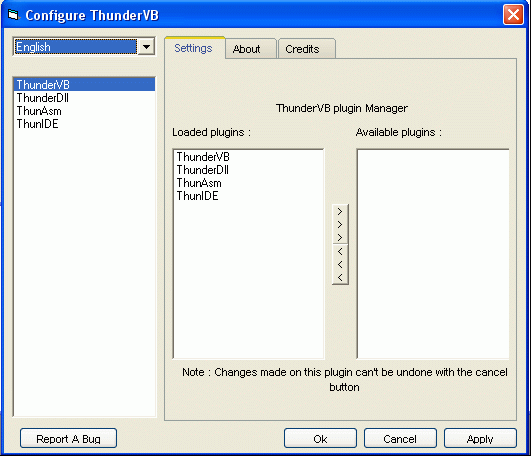



## ThunderVB \- First Release

### Description

ThunderVB is an add-in for VB6. ThunderVB let's you embed Asm and C instructions directly in you VB source programs. Furthermore ThunVB let's you create a true StdCall Dlls.

Moreover ThunVB can extend VB IDE to a basic Asm/C code editor. That means it can do syntax-highlighting of Asm/C keywords and supports intelli-sense for InlineAsm code as well.

See the screenshots bellow.

--- ThunderVB Development Team [ drkIIRaziel &amp; Libor ] ---
 
### More Info
 
Recommended OS is WinXP or Win2000 (not tested on Win2000 but it should work) and VB6 with service pack 6.

             |
---                |---
**Submitted On**   |2005-08-02 02:02:00
**By**             |[ThunderVB development Team](https://github.com/Planet-Source-Code/PSCIndex/blob/master/ByAuthor/thundervb-development-team.md)
**Level**          |Advanced
**User Rating**    |5.0 (329 globes from 66 users)
**Compatibility**  |VB 6\.0
**Category**       |[Complete Applications](https://github.com/Planet-Source-Code/PSCIndex/blob/master/ByCategory/complete-applications__1-27.md)
**World**          |[Visual Basic](https://github.com/Planet-Source-Code/PSCIndex/blob/master/ByWorld/visual-basic.md)
**Archive File**   |[ThunderVB\_192010822005\.zip](https://github.com/Planet-Source-Code/thundervb-development-team-thundervb-first-release__1-62038/archive/master.zip)

